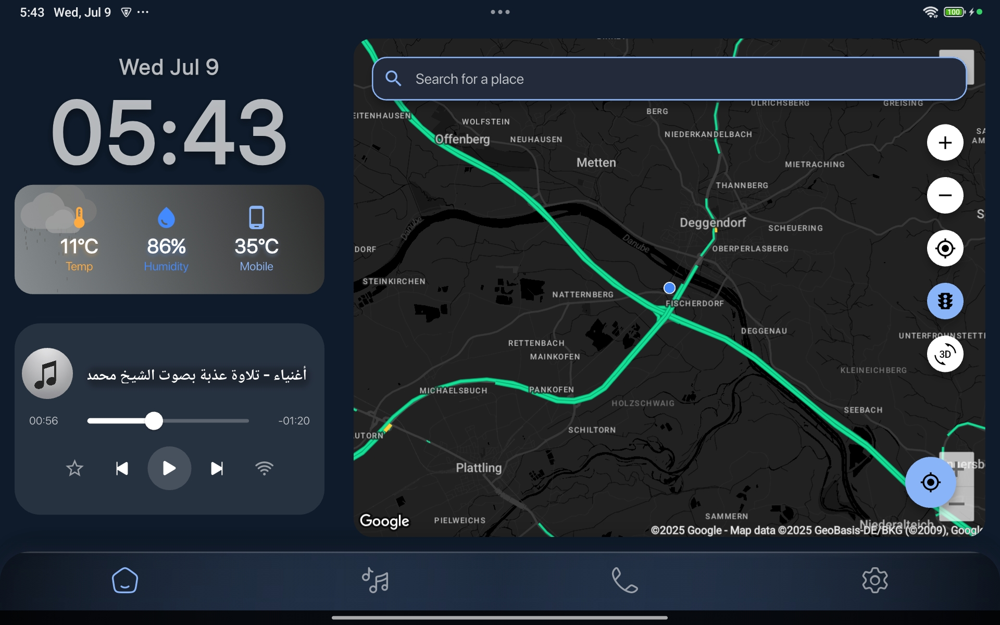
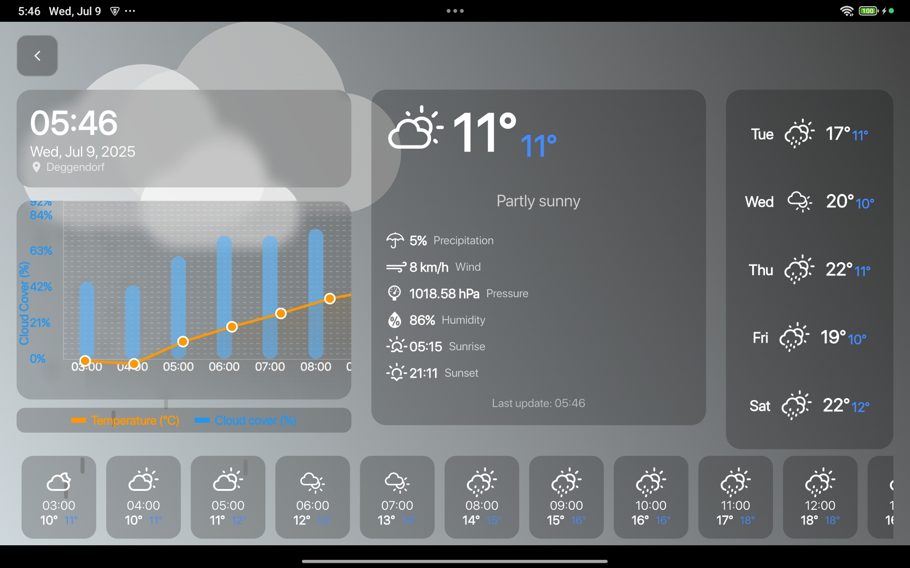
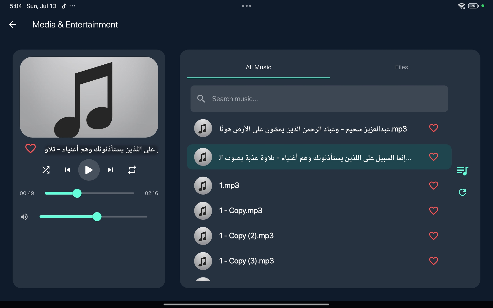
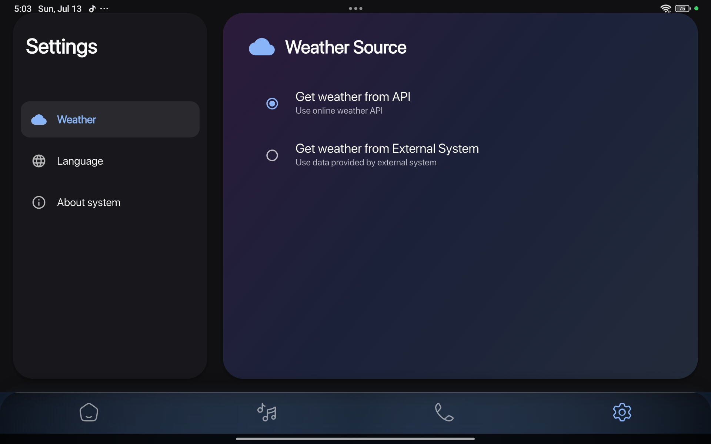
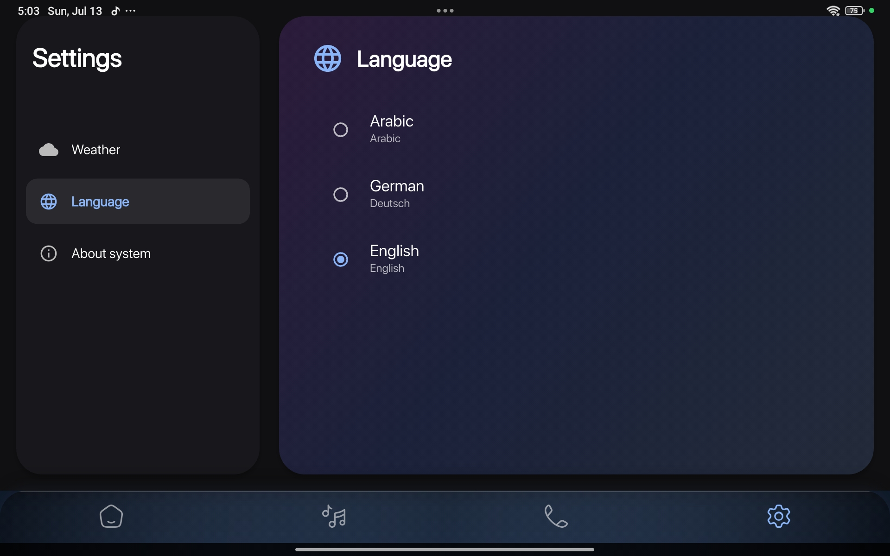
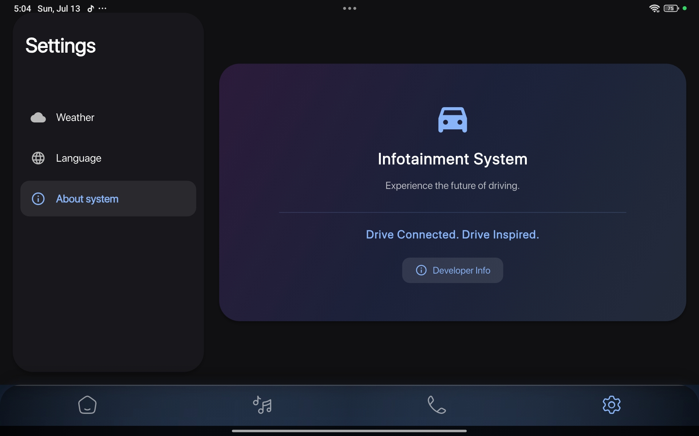
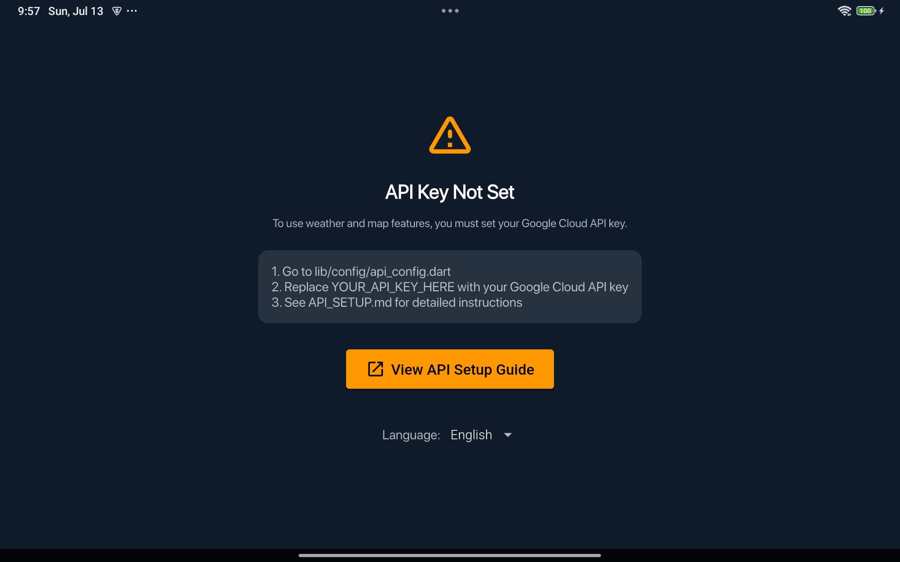

[](doc/api/index.html)
[](https://flutter.dev)
[](https://dart.dev)
[](LICENSE)
[](https://github.com/arhassan98/infotainment_system/issues)
[](https://github.com/arhassan98/infotainment_system/actions/workflows/flutter.yml)
[](https://github.com/arhassan98/infotainment_system/commits/main)
[](https://github.com/arhassan98/infotainment_system/pulls)

# Infotainment System

A Flutter-based automotive infotainment system with weather information, music player, and location services. Designed for tablet interfaces with landscape orientation.

## Features

- 🌤️ Real-time weather information and forecasts
- 🎵 Music player with local file support
- 📍 Location-based services and navigation
- 🌍 Multi-language support (English, Arabic, German)
- 🎨 Modern, responsive UI optimized for tablets
- 📱 Landscape orientation support
- 🔄 Auto-refresh weather data
- 🎯 Touch-optimized controls

## Architecture

This project follows the **MVC (Model-View-Controller)** pattern, organized as follows:

- **lib/models/**: Data models (e.g., Song, Weather, Settings, Location)
- **lib/controllers/**: Business logic and state management (e.g., MusicPlayerController, WeatherController, SettingsController, LocationController)
- **lib/views/**: UI screens and widgets (e.g., HomeScreen, MusicPlayerView, WeatherDetailsView, SettingsView)
- **lib/constants/**: Centralized constants (e.g., app_colors.dart)
- **lib/l10n/**: Localization files
- **lib/config/**: API and environment configuration

**State Management:**
- Uses [Provider](https://pub.dev/packages/provider) for dependency injection and state management.
- All main controllers are provided at the top level in `main.dart` using `MultiProvider`.

**API Key Check & HelloScreen:**
- On first launch, the app checks if a valid Google Cloud API key is set in `lib/config/api_config.dart`.
- If the API key is missing or invalid, a **HelloScreen** is shown with clear instructions and a language switcher (English/German) to guide the user.
- Once a valid API key is set, the full infotainment system UI is shown.

**Adding New Features:**
- Create a model for your data in `lib/models/`.
- Implement a controller in `lib/controllers/` for business logic/state.
- Build the UI in `lib/views/`, using Provider to access controllers.

**Constants & Assets:**
- Use `lib/constants/app_colors.dart` for color definitions and avoid hardcoding values in views.
- All assets (images, fonts) are managed in the `assets/` directory and referenced in `pubspec.yaml`.

---

## Screenshots

| Home Screen | Weather Screen | Music Player |
|:-----------:|:--------------:|:------------:|
|  |  |  |

| Settings - About | Settings - Weather | Settings - Language |
|:----------------:|:------------------:|:-------------------:|
|  |  |  |

## API Key Not Set Screen

If the API key is not set or invalid, the app will show a clear message and guide the user to set up their Google Cloud API key. Example:



## Tested Device

- **Device**: Xiaomi Redmi Pad SE 11-inch
- **OS**: Android 13
- **Orientation**: Landscape (recommended)
- **Screen Resolution**: 1920x1200

## Getting Started

### Prerequisites

- Flutter SDK (latest stable version) - [Install Flutter](https://flutter.dev/docs/get-started/install)
- Dart SDK (included with Flutter)
- Android Studio / VS Code
- Google Cloud API key (see [API Setup Guide](API_SETUP.md))
- Android device or emulator for testing

### First Launch & API Key Setup

- On first launch, the app will show a **HelloScreen** if the API key is not set.
- The HelloScreen provides step-by-step instructions and allows you to switch between English and German.
- To enable weather and map features, set your Google Cloud API key in `lib/config/api_config.dart` as instructed.
- After setting the API key, restart the app to access the full infotainment system.

### Installation

1. Clone the repository:
   ```bash
   git clone <your-repository-url>
   cd infotainment_system
   ```

2. Install dependencies:
   ```bash
   flutter pub get
   ```

3. Set up API keys (required for weather and maps features):
   ```bash
   # Follow the instructions in API_SETUP.md
   cp lib/config/api_config_template.dart lib/config/api_config.dart
   cp android/app/src/main/AndroidManifest.template.xml android/app/src/main/AndroidManifest.xml
   
   # Edit the files with your actual API keys
   # lib/config/api_config.dart - for Dart code
   # android/app/src/main/AndroidManifest.xml - for Android Maps
   ```

4. Run the app:
   ```bash
   flutter run
   ```

## Testing

### Running Tests

1. **Unit Tests**:
   ```bash
   flutter test
   ```

2. **Integration Tests**:
   ```bash
   flutter test integration_test/
   ```

3. **Widget Tests**:
   ```bash
   flutter test test/widget_test.dart
   ```

### Manual Testing Checklist

#### Core Features
- [ ] App launches without crashes
- [ ] Weather information displays correctly
- [ ] Music player loads and plays local files
- [ ] Location services work properly
- [ ] Multi-language switching works
- [ ] Settings screen is accessible

#### UI/UX Testing
- [ ] Landscape orientation displays correctly
- [ ] Touch controls are responsive
- [ ] Navigation between screens works
- [ ] Text is readable on tablet screen
- [ ] Icons and buttons are appropriately sized

#### Device-Specific Testing
- [ ] Test on Xiaomi Redmi Pad SE 11-inch
- [ ] Verify Android 13 compatibility
- [ ] Check storage permissions work
- [ ] Test music file scanning
- [ ] Verify location permissions

### Performance Testing

1. **Memory Usage**:
   ```bash
   flutter run --profile
   # Monitor memory usage in Android Studio Profiler
   ```

2. **Performance Analysis**:
   ```bash
   flutter run --profile --trace-startup
   ```

3. **App Size Analysis**:
   ```bash
   flutter build apk --analyze-size
   ```

## Building APK

### Debug APK
```bash
flutter build apk --debug
```
**Location**: `build/app/outputs/flutter-apk/app-debug.apk`

### Release APK
```bash
flutter build apk --release
```
**Location**: `build/app/outputs/flutter-apk/app-release.apk`

### Split APKs (Recommended for Play Store)
```bash
flutter build apk --split-per-abi --release
```
**Locations**:
- `build/app/outputs/flutter-apk/app-armeabi-v7a-release.apk`
- `build/app/outputs/flutter-apk/app-arm64-v8a-release.apk`
- `build/app/outputs/flutter-apk/app-x86_64-release.apk`

### App Bundle (Play Store)
```bash
flutter build appbundle --release
```
**Location**: `build/app/outputs/bundle/release/app-release.aab`

## Installation on Device

### Via ADB (Development)
```bash
# Enable USB debugging on your device
adb install build/app/outputs/flutter-apk/app-debug.apk
```

### Via File Transfer
1. Copy the APK file to your device
2. Enable "Install from unknown sources" in Android settings
3. Open the APK file and install

### Via Play Store (Release)
1. Upload the AAB file to Google Play Console
2. Follow Play Store publishing guidelines
3. Wait for review and approval

## Configuration

See [API_SETUP.md](API_SETUP.md) for detailed instructions on setting up Google Cloud API keys.

### Environment Variables (Optional)
For production deployments, consider using environment variables:
```bash
export GOOGLE_CLOUD_API_KEY="your_api_key_here"
export ANDROID_MAPS_API_KEY="your_android_maps_key_here"
```

## Troubleshooting

### Common Issues

1. **API Key Errors**:
   - Verify API keys are correctly set in configuration files
   - Check Google Cloud Console for API enablement
   - Ensure API key restrictions are properly configured

2. **Permission Issues**:
   - Grant storage permissions manually in Android settings
   - Enable location permissions for weather features
   - Check microphone permissions for voice features

3. **Build Errors**:
   ```bash
   flutter clean
   flutter pub get
   flutter build apk --release
   ```

4. **Performance Issues**:
   - Use release builds for performance testing
   - Monitor memory usage with Android Studio Profiler
   - Check for memory leaks in long-running operations

### Device-Specific Issues

**Xiaomi Redmi Pad SE**:
- Ensure MIUI optimization is disabled for the app
- Grant all necessary permissions in MIUI settings
- Check battery optimization settings

## Security

- API keys are stored in separate configuration files that are ignored by Git
- Never commit actual API keys to version control
- Use API key restrictions in Google Cloud Console for production
- Implement proper error handling to avoid exposing sensitive information

## Performance Optimization

- Use release builds for production testing
- Optimize image assets for tablet displays
- Implement proper caching for weather data
- Use efficient data structures for music file management

## Contributing

1. Fork the repository
2. Create a feature branch
3. Make your changes
4. Test thoroughly on target device
5. Update documentation if needed
6. Submit a pull request

### Development Guidelines

- Follow Flutter best practices
- Test on the target device (Xiaomi Redmi Pad SE)
- Ensure landscape orientation compatibility
- Maintain responsive design principles
- Add appropriate error handling

## License

This project is licensed under the MIT License.

## Support

For issues and questions:
- Check the [troubleshooting section](#troubleshooting)
- Review [API_SETUP.md](API_SETUP.md) for configuration help
- Create an issue in the repository
